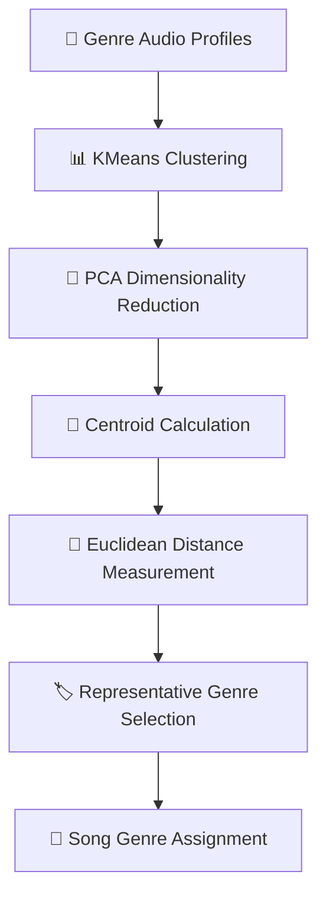

# 🎵 Spotify Music Analysis & Recommendation System

[](https://python.org)
[](https://pandas.pydata.org)
[](https://scikit-learn.org)

A comprehensive music analysis project utilizing Spotify data to explore musical trends, perform genre classification, and build intelligent recommendation systems spanning nearly a century of music (1921-2020).

## 📋 Table of Contents

- [Dataset Overview](#dataset-overview)
- [Audio Features](#audio-features)
- [Data Analysis](#data-analysis)
  - [Feature Distribution](#feature-distribution)
  - [Correlation Analysis](#correlation-analysis)
  - [Trend Analysis Over Time](#trend-analysis-over-time)
  - [Popularity Analysis](#popularity-analysis)
- [Genre Classification Strategy](#genre-classification-strategy)
- [Recommendation Systems](#recommendation-systems)
- [Visualization Features](#visualization-features)
- [Dataset Limitations](#dataset-limitations)
- [Future Research](#future-research)
- [Installation & Usage](#installation--usage)

## 📊 Dataset Overview

This comprehensive music analysis utilizes **five primary datasets** to explore musical trends, genre classification, and recommendation systems:

| Dataset | Description | Key Features |
|---------|-------------|--------------|
| **`data.csv`** | Main dataset with comprehensive music information | 🎯 Predicted genre classifications, recommendation foundation |
| **`data_by_artists.csv`** | Artist-level aggregated data | 👨‍🎤 Performer statistics, popularity metrics, audio features |
| **`data_genres.csv`** | Genre definitions with audio feature values | 🎼 Clustering analysis, representative genre selection |
| **`data_w_genres.csv`** | Artist records with audio features and genres | 🎵 Genre-based analysis and classification |
| **`data_by_year.csv`** | Temporal data (1921-2020) | 📅 Year-based trends, popularity evolution |

### 📁 Dataset Structure
```
📁 spotify-music-analysis/
├── 📊 data/
│   ├── 📄 data.csv (Main dataset)
│   ├── 📄 data_by_artists.csv (Artist metrics)
│   ├── 📄 data_genres.csv (Genre definitions)
│   ├── 📄 data_w_genres.csv (Songs with genres)
│   └── 📄 data_by_year.csv (Temporal trends)
└── 📈 analysis/
```

## 🎼 Audio Features

The analysis focuses on **8 critical audio features** and metadata fields:

### 🎵 Audio Characteristics

| Feature | Range | Description |
|---------|-------|-------------|
| **Acousticness** | 0.0 - 1.0 | 🎸 Measure of acoustic vs electronic sound |
| **Danceability** | 0.0 - 1.0 | 💃 Suitability for dancing based on rhythm |
| **Energy** | 0.0 - 1.0 | ⚡ Perceptual intensity and power |
| **Instrumentalness** | 0.0 - 1.0 | 🎺 Likelihood of no vocals |
| **Liveness** | 0.0 - 1.0 | 🎤 Presence of live audience |
| **Speechiness** | 0.0 - 1.0 | 🗣️ Amount of spoken words |
| **Valence** | 0.0 - 1.0 | 😊 Musical positivity/emotional tone |
| **Tempo** | BPM | 🥁 Beats per minute |

### 📋 Metadata Fields

- **Year**: Release year (1921-2020)
- **Popularity**: Popularity score metric
- **Mode**: Musical mode (major/minor)
- **Key**: Musical key signature
- **Genre**: Predicted/assigned classifications

## 📈 Data Analysis

### 🎯 Feature Distribution

**Key Insights:**
- 📊 **Bimodal Features**: Acousticness and Instrumentalness show clear categorical divisions
- 📈 **Normal Distribution**: Danceability and Energy follow standard distributions
- 🎵 **Vocal Dominance**: Majority of tracks contain vocals (low instrumentalness)
- 🔊 **High Volume Mastering**: Most songs are mastered at high volumes
- 🌈 **Emotional Range**: Valence shows uniform distribution across emotional spectrum

> **💡 Application**: These characteristics enable mood-based recommendations, energy-focused playlists, and vocal/instrumental filtering.

### 🔗 Correlation Analysis

#### 🔥 Strong Positive Correlations
| Feature Pair | Correlation | Insight |
|--------------|-------------|---------|
| **Energy ↔ Loudness** | 0.78 | 🔊 Louder songs feel more energetic |
| **Danceability ↔ Valence** | 0.56 | 💃 Happy songs are more danceable |
| **Energy ↔ Valence** | 0.35 | ⚡ High-energy songs often sound happier |

#### ❄️ Strong Negative Correlations
| Feature Pair | Correlation | Insight |
|--------------|-------------|---------|
| **Acousticness ↔ Energy** | -0.75 | 🎸 Acoustic tracks are less energetic |
| **Acousticness ↔ Loudness** | -0.56 | 🔇 Acoustic songs are generally quieter |
| **Instrumentalness ↔ Loudness** | -0.41 | 🎺 Instrumental tracks tend to be softer |

#### 🎯 Unique Features
- **Liveness**, **Speechiness**, and **Tempo** show weak correlations
- These provide unique, independent information for recommendation systems

### 📅 Trend Analysis Over Time (1925-2020)

#### 📈 Increasing Trends
- **🕺 Danceability**: Steady rise from 1970s (disco, EDM, rhythm-focused pop)
- **⚡ Energy & Loudness**: Consistent upward trend (high-energy genres, production advances)
- **🗣️ Speechiness**: Slight increase (rap, hip-hop, spoken-word elements)

#### 📉 Decreasing Trends  
- **🎸 Acousticness**: Significant decline (shift to electronic/digital sounds)
- **😔 Valence**: Lower in recent decades (darker, introspective themes)

#### 🔄 Stable Trends
- **🎺 Instrumentalness**: Remained low (vocal dominance in popular music)

> **🎭 Cultural Impact**: These trends reflect broader cultural shifts, technological advances, and changing listener preferences over nearly a century.

### 🏆 Popularity Analysis

#### 📊 Key Findings
- **🎵 Valence vs Popularity**: No clear linear relationship
  - Both happy (high valence) and moody (low valence) songs achieve popularity
  - Emotional tone doesn't strictly determine mainstream success

- **🔞 Explicit Content Impact**: 
  - Explicit songs show higher median popularity
  - Suggests explicit content may attract larger audiences

## 🎯 Genre Classification Strategy

### 🧠 Representative Genre Mapping via Centroid Proximity (RGCP)

Before building recommendation systems, a sophisticated **data-driven genre assignment strategy** was developed to label songs lacking genre information.

#### 🔄 Three-Step Process



#### **Step 1: Clustering Genre Audio Profiles**
- Applied **KMeans clustering** to `data_by_genres` dataset
- Used **PCA-transformed features** for enhanced separation
- Grouped genres by similar acoustic properties

#### **Step 2: Selecting Representative Genres**
- Calculated **Euclidean distances** between cluster centroids and all genres
- Selected closest genre as **cluster representative**
- Ensured each cluster maps to a prototypical genre

#### **Step 3: Assigning Genres to Songs**
- Used `.predict()` method to assign songs to clusters
- Applied representative genre labels to all songs
- Enabled scalable, consistent genre classification

> **✅ Result**: Successfully enhanced dataset with genre labels based purely on acoustic signatures, enabling downstream recommendation tasks.

## 🎯 Recommendation Systems

Five distinct recommendation systems provide tailored music suggestions for different user needs and contexts:

### 1. 🎵 Content-Based Recommendation

**🔍 How it Works:**
- Calculates **cosine similarity** between song feature vectors
- Ranks songs by acoustic similarity to input track
- Returns most sonically similar recommendations

**✅ Strengths:**
- Personalized based on intrinsic music qualities
- No external metadata dependency
- Excellent for finding "songs like this"

**❌ Limitations:**
- Limited variety (acoustically similar results)
- No user behavior consideration
- May miss popular alternatives

### 2. 🎼 Genre-Based Recommendation

**🔍 How it Works:**
- Filters dataset by specified genre
- Sorts by popularity within genre
- Returns top tracks in category

**✅ Strengths:**
- Quick genre exploration
- Mainstream appeal within categories
- Simple, intuitive interface

**❌ Limitations:**
- No personalization (same results for all users)
- Limited to 10 clusters (insufficient granularity)
- Risk of genre misclassification
- Overlooks emerging artists

### 3. 🔄 Hybrid Recommendation (Content + Popularity)

**🔍 How it Works:**
```python
hybrid_score = (similarity_weight × similarity) + (popularity_weight × normalized_popularity)
```

**✅ Strengths:**
- Balances relevance and recognition
- Adjustable weighting parameters
- Combines multiple recommendation approaches

**❌ Limitations:**
- Requires precise parameter calibration
- May bias toward established artists
- Complex optimization needed

### 4. 😊 Mood-Based Recommendation

**🔍 Mood Definitions:**

| Mood | Criteria | Thresholds |
|------|----------|------------|
| **😄 Happy** | High valence + energy | Valence: 75th percentile, Energy: 60th percentile |
| **😢 Sad** | Low valence + energy | Valence: 25th percentile, Energy: 40th percentile |
| **⚡ Energetic** | High energy + tempo | Energy: 85th percentile, Tempo: 75th percentile |
| **😌 Calm** | Low energy + tempo | Energy: 30th percentile, Tempo: 40th percentile |
| **💃 Danceable** | High danceability | Danceability: 75th percentile |

**✅ Strengths:**
- Emotional and situational relevance
- No explicit input requirements
- Activity-based recommendations

**❌ Limitations:**
- Heuristic threshold estimates
- No personalization learning
- May not match individual perceptions

### 5. 📅 Era-Based Recommendation

**🔍 How it Works:**
- Filters by year range selection
- Sorts by popularity within timeframe
- Enables temporal music exploration

**✅ Strengths:**
- Nostalgia and historical exploration
- Time-period specific discovery
- Educational value

**❌ Limitations:**
- Depends on accurate release year data
- No feature-based similarity
- Limited to temporal filtering

### 🛠️ Unified Music Recommendation Tool

**🎯 Multi-Input Interface:**
```python
def get_recommendations(input_type, input_value, num_recommendations=10):
    """
    Unified recommendation function supporting:
    - Song: Specific track name
    - Genre: Music category
    - Mood: Emotional state
    - Era: Time period range
    """
```

## 📊 Visualization Features

### 🕸️ Evolution of Music Features over Decades

**Radar Chart Analysis** showing feature changes across decades:

#### 📈 Key Evolution Patterns (1920s-1950s)

| Feature | Trend | Insight |
|---------|-------|---------|
| **🎸 Acousticness** | ⬇️ Dramatic decline (0.8 → 0.6) | Shift from acoustic to electric/amplified |
| **😊 Valence** | ➡️ Stable (0.5-0.6) | Consistent emotional tone |
| **⚡ Energy** | ⬆️ Gradual increase | Music became more dynamic |
| **💃 Danceability** | ⬆️ Steady growth | Rise of swing, big band, early rock |
| **🗣️ Speechiness** | ➡️ Low & stable | Focus on musical vs spoken content |
| **🎤 Liveness** | ➡️ Low & stable | Studio recording dominance |
| **🎺 Instrumentalness** | ➡️ Low & stable | Vocal-centered compositions |

### 📈 Music Popularity Evolution (1920-2020)

**Three Distinct Eras:**

#### 🕰️ 1920s-1940s: Low, Stable Period
- **Popularity**: Under 10 (very low)
- **Factors**: Limited recording technology, distribution methods

#### 🚀 1950s-1960s: The Great Acceleration  
- **Popularity**: Sharp increase (0 → 35-40)
- **Factors**: Rock and roll, improved technology, radio expansion

#### 📱 1970s-2020s: Steady Exponential Growth
- **Popularity**: Consistent climb (35 → 60+)
- **Factors**: Digital revolution, streaming platforms, global accessibility

## ⚠️ Dataset Limitations

### 🎼 Limited Genre Granularity
- ❌ Only **10 clusters** identified (insufficient musical diversity)
- ❌ Risk of genre misclassification and outliers
- ❌ Lack of hierarchical genre structures

### 📝 Missing Critical Information
- ❌ Song titles absent from `data_w_genres.csv`
- ❌ Incomplete artist metadata across datasets
- ❌ Limited temporal granularity in historical periods

### 🎯 Threshold Limitations
- ❌ Mood classification relies on **heuristic percentile-based thresholds**
- ❌ Fixed thresholds ignore individual/cultural differences
- ❌ No validation against actual user preferences

### 👤 Personalization Gaps
- ❌ No user preference integration
- ❌ Missing demographic/behavioral data
- ❌ Limited feedback mechanisms

## 🚀 Future Research Recommendations

### 🔬 Enhanced Genre Classification

#### 🌳 Hierarchical Clustering
```
Main Genres → Sub-genres → Micro-genres
    Rock → Alternative Rock → Indie Rock
    Hip-Hop → Trap → Melodic Trap
```

#### 🤖 Advanced Methods
- **Dynamic Clustering**: Adaptive methods for evolving musical styles
- **Expert Validation**: Musicologist input for accuracy
- **Cross-Dataset Validation**: Multiple database verification

### 🎯 Improved Recommendation Systems

#### 👤 User Profiling
- **Demographics**: Age, location, cultural background
- **Listening History**: Past preferences and patterns
- **Explicit Preferences**: User-declared favorites

#### 🌍 Contextual Awareness
- **Temporal Context**: Time of day, season
- **Activity Context**: Working, exercising, relaxing
- **Location Context**: Home, commute, social settings

#### 🔄 Feedback Integration
- **Rating Systems**: Explicit user feedback
- **Implicit Feedback**: Skip rates, replay counts
- **A/B Testing**: Systematic approach comparison

### ⚙️ Technical Improvements

#### 📈 Scalability Solutions
- **Distributed Computing**: Large-scale analysis capability
- **Real-Time Processing**: Live recommendation updates
- **API Integration**: Major platform connectivity

#### 🔒 Privacy & Security
- **Differential Privacy**: User data protection
- **Federated Learning**: Decentralized model training
- **Data Anonymization**: Identity protection methods

## 📦 Installation & Usage

### 🛠️ Prerequisites
```bash
Python 3.8+
pandas >= 1.3.0
scikit-learn >= 1.0.0
matplotlib >= 3.5.0
seaborn >= 0.11.0
plotly >= 5.0.0
```

### 📥 Installation
```bash
# Clone repository
git clone https://github.com/yourusername/spotify-music-analysis.git
cd spotify-music-analysis

# Install dependencies
pip install -r requirements.txt

# Run analysis
python main.py
```

### 🎯 Quick Start
```python
from music_recommender import UnifiedRecommendationSystem

# Initialize system
recommender = UnifiedRecommendationSystem()

# Get recommendations
songs = recommender.recommend(
    input_type="mood",
    input_value="happy",
    num_recommendations=10
)
```

## 📊 Repository Structure
```
📁 spotify-music-analysis/
├── 📄 README.md
├── 📄 requirements.txt
├── 📁 data/
│   ├── 📊 data.csv
│   ├── 📊 data_by_artists.csv
│   ├── 📊 data_genres.csv
│   ├── 📊 data_w_genres.csv
│   └── 📊 data_by_year.csv
├── 📁 src/
│   ├── 🐍 data_preprocessing.py
│   ├── 🐍 genre_classification.py
│   ├── 🐍 recommendation_systems.py
│   ├── 🐍 visualization.py
│   └── 🐍 main.py
├── 📁 notebooks/
│   ├── 📓 01_data_exploration.ipynb
│   ├── 📓 02_genre_classification.ipynb
│   ├── 📓 03_recommendation_systems.ipynb
│   └── 📓 04_visualization_analysis.ipynb
├── 📁 results/
│   ├── 📈 correlation_matrix.png
│   ├── 📊 feature_evolution.png
│   └── 📉 popularity_trends.png
└── 📁 tests/
    ├── 🧪 test_recommendations.py
    └── 🧪 test_classification.py
```

---

## 🤝 Contributing
Contributions are welcome! Please read our [Contributing Guidelines](CONTRIBUTING.md) for details.

## 📞 Support
- 📧 **Email**: [aniwurakehinde@gmail.com](mailto:aniwurakehinde@gmail.com)

---

> **🎵 "Music is the universal language of mankind."** - Henry Wadsworth Longfellow

**⭐ If you found this project helpful, please give it a star!**
